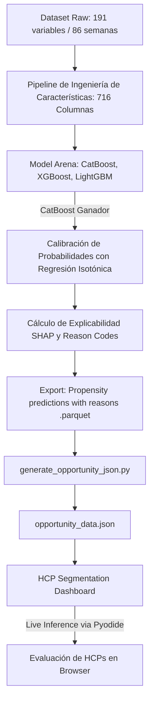
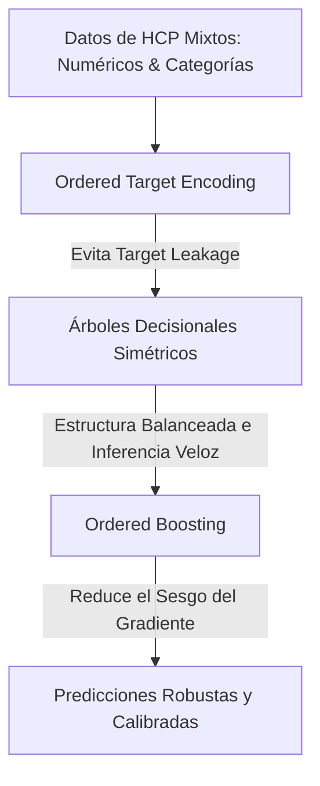

# Documentación Técnica: Sistema de Analítica de HCP y Dashboard de Segmentación

Este documento contiene la documentación técnica completa del **HCP Segmentation Dashboard** (Ulcerative Colitis) y del **Modelo de Propensión CatBoost** implementado para la priorización comercial de profesionales de la salud (HCPs).

---

## Índice

1. [Visión General del Sistema](#1-visión-general-del-sistema)
2. [HCP Segmentation Dashboard (Front-End)](#2-hcp-segmentation-dashboard-front-end)
   - [Pestañas y Secciones de Negocio](#pestañas-y-secciones-de-negocio)
   - [Sistema de Interacción y Priorización](#sistema-de-interacción-y-priorización)
   - [Motor de Inferencia en Cliente (WebAssembly / Pyodide)](#motor-de-inferencia-en-cliente-webassembly--pyodide)
3. [Arquitectura del Front-End e Implementación](#3-arquitectura-del-front-end-e-implementación)
   - [Stack Tecnológico](#stack-tecnológico)
   - [Sistema de Diseño y Estética Premium](#sistema-de-diseño-y-estética-premium)
4. [Pipeline de Ingeniería de Datos](#4-pipeline-de-ingeniería-de-datos)
   - [Procesamiento Longitudinal](#procesamiento-longitudinal)
   - [Capa de Extracción de Oportunidad (`generate_opportunity_json.py`)](#capa-de-extracción-de-oportunidad-generate_opportunity_jsonpy)
5. [Modelo Predictivo CatBoost (Deep-Dive de Machine Learning)](#5-modelo-predictivo-catboost-deep-dive-de-machine-learning)
   - [Arquitectura de CatBoost (Categorical Boosting)](#arquitectura-de-catboost-categorical-boosting)
   - [Por qué CatBoost supera a XGBoost y LightGBM](#por-qué-catboost-supera-a-xgboost-y-lightgbm)
   - [Ingeniería de Características y Representación Tensorial](#ingeniería-de-características-y-representación-tensorial)
   - [Optimización de Hiperparámetros (Optuna Arena)](#optimización-de-hiperparámetros-optuna-arena)
   - [Métricas de Evaluación: PR-AUC vs. ROC-AUC](#métricas-de-evaluación-pr-auc-vs-roc-auc)
   - [Calibración de Probabilidades mediante Regresión Isotónica](#calibración-de-probabilidades-mediante-regresión-isotónica)
   - [Explicabilidad e Interacciones locales con SHAP](#explicabilidad-e-interacciones-locales-con-shap)

---

## 1. Visión General del Sistema

El sistema es una solución integrada de analítica avanzada para el mercado de Colitis Ulcerosa (UC). Su objetivo principal es **identificar, segmentar y priorizar el esfuerzo comercial** sobre médicos (HCPs), convirtiendo datos masivos de comportamiento longitudinal en directrices accionables en tiempo real para las redes de ventas.

El flujo de valor consta de:
1. **Pipeline de Modelado**: Procesa datos históricos longitudinales (86 semanas), entrena un ensamble de Gradient Boosting (CatBoost) optimizado, calibra las predicciones para generar verdaderas probabilidades empíricas y calcula valores SHAP para justificar localmente la propensión de cada HCP.
2. **Capa de Negocio (Backend/ETL)**: Filtra y clasifica la base de datos de HCPs, separando el grupo etiquetado (*Labeled*) del grupo sin etiqueta comercial (*Unlabeled*). Identifica la **Brecha de Cobertura** (médicos con alta propensión pero cero o bajas visitas del representante de ventas).
3. **Frontend Interactivo**: Un panel web moderno y responsivo que renderiza los KPIs agregados, permite hacer *drill-down* hasta el nivel de HCP individual, prioriza dinámicamente mediante cohortes interactivas y permite ejecutar inferencia local utilizando WebAssembly.



---

## 2. HCP Segmentation Dashboard (Front-End)

El Dashboard está estructurado en pestañas diseñadas para guiar al usuario comercial desde una vista ejecutiva global hasta la acción táctica sobre médicos específicos.

### Pestañas y Secciones de Negocio

#### A. Executive Summary (Resumen Ejecutivo)
Ofrece una visión general de la población total analizada ($20,931$ HCPs), dividida en la cohorte etiquetada ($11,899$ HCPs, 56.9%) y el pool sin etiqueta ($9,032$ HCPs).
- **KPI Cards Animadas**: Renderizan el conteo de médicos, columnas procesadas ($716$) y pools de oportunidad mediante contadores con aceleración cúbica fluida.
- **Gráfico de Embudo (Funnel Chart)**: Visualiza la distribución jerárquica de la población desde el mercado total hasta el volumen interno de cada segmento.
- **Gráfico de Donut**: Muestra la representatividad interna de cada segmento etiquetado:
  - **SEG_A (Traditional)**: 6,406 HCPs (53.8%)
  - **SEG_B (Relationship)**: 3,349 HCPs (28.2%)
  - **SEG_C (Didactic)**: 2,144 HCPs (18.0%)
- **Mapa Térmico de Métricas Normalizadas**: Compara características con escalas sumamente dispares (ej. *UC TRx/wk* de 0.17 vs. *Details/Rx* de 0.94) aplicando una normalización Min-Max en tiempo real para evaluar fortalezas relativas en un solo gráfico de barras agrupadas.

#### B. Segment Deep-Dive (Análisis Detallado de Segmentos)
Permite caracterizar las tres personalidades (personas) de HCP identificadas mediante el modelo no supervisado preliminar:
1. **Segmento A (Traditional)**: Prescriptores tradicionales y resistentes al cambio terapéutico. Poseen el menor volumen de prescripción (*0.171 UC TRx/sem*), la menor participación de marca Pfizer (*0.36%*) y demandan el mayor esfuerzo de ventas por receta generada (*0.94 visitas por Rx*).
2. **Segmento B (Relationship)**: Médicos altamente influenciables por la relación con el representante y canales digitales. Registran la mayor tasa de crecimiento dinámico (*9.6% creciendo*), adopción acelerada y una excelente conversión comercial (*0.44 visitas por Rx*). **Es el objetivo comercial de máxima prioridad**.
3. **Segmento C (Didactic)**: Prescriptores impulsados por evidencia clínica y protocolos científicos. Poseen la mayor lealtad biológica de clase (*11.3% de share IL-23*) y el mayor volumen de Colitis Ulcerosa (*0.711 UC TRx/sem*). Responden eficientemente al contacto (*0.38 visitas por Rx*). **Objetivo de conversión de alto valor**.
- **Longitudinal Journeys (Líneas de Tiempo de 86 semanas)**: Gráficos de doble eje vertical (Eje Izquierdo: Volumen Total de UC; Eje Derecho: Ventas de Marca Pfizer vs. Competidor) que modelan el comportamiento detallado semana a semana de tres líderes de opinión representativos: *Dr. Brian Chen* (SEG_B), *Dr. Catherine Williams* (SEG_C), y *Dr. Ana Lopez* (SEG_A).

#### C. Brand Adoption (Adopción de Marca)
Mapea el recorrido de adopción de la marca insignia de Pfizer.
- **Estadísticas Clave**: Identifica que el **91.4%** de la base aún no ha probado el biológico de Pfizer (*Never Tried*), mientras que solo el **5.0%** es activo y el **2.6%** ha caído en inactividad (*Lapsed*).
- **Funnel Stacked Bars**: Muestran el embudo de adopción en porcentaje y valores absolutos para cada segmento.
- **Señales de Crecimiento**: Compara el porcentaje de prescriptores en aceleración comercial acelerada y de nuevos adoptantes recientes.

#### D. Commercial Insights (Inteligencia Competitiva)
Analiza la presión ejercida por el principal rival del mercado (Brand 2).
- **Presión Competitiva**: Brand 2 supera a Pfizer por un factor de **3.9× a 4.4×** en todos los segmentos. La brecha es máxima en el Segmento B (4.43×), consolidándolo como el campo de batalla comercial crítico.
- **Gráfico de Dispersión de Adopción (Scatter Plot)**: Cruza el volumen promedio de UC contra la participación de mercado de Pfizer a nivel HCP individual para mapear la concentración de marca.
- **Sección Rep Engagement ROI**: Analiza la eficiencia promocional cruzando visitas totales con recetas emitidas. Muestra un gráfico de dispersión de visitas del representante acumuladas frente a la generación de recetas semanales.

#### E. Unlabeled Opportunity (Priorización del Pool Oportunidad)
La pestaña más avanzada operacionalmente, diseñada para identificar la **Brecha de Cobertura**.
- **Tiering Cards**: Divide el universo de médicos no etiquetados según su probabilidad predictiva (Opportunity Score):
  - **Tier 1 (Priority Outreach)**: Score $\ge 0.60$ (Acción inmediata).
  - **Tier 2 (Validation Needed)**: Score $0.35$ a $0.59$ (Validación médica).
  - **Tier 3 (Baseline Monitoring)**: Score $< 0.35$ (Monitoreo pasivo).
- **Coverage Gap Alerts**: Calcula y expone dinámicamente cuántos médicos de alto potencial están sin cobertura (definido como $\le 5$ visitas acumuladas).
- **Opportunity Scatter Plot**: Renderiza cientos de HCPs cruzando su volumen de Colitis Ulcerosa (*eje X*) con su puntuación de propensión predictiva (*eje Y*). Los puntos en **rojo** representan médicos en la brecha (cero o bajas visitas), y en **azul** aquellos ya cubiertos.

---

### Sistema de Interacción y Priorización

El dashboard implementa una arquitectura interactiva de tres niveles para habilitar la toma de decisiones ágil:

1. **Filtros por Cohortes Dinámicas**: Al hacer clic en cualquiera de las *Tier Cards* o en los botones de cobertura (*Low/No Visits* / *Covered*), la aplicación genera en tiempo real una tabla interactiva de prospección (`#cohort-table-panel`) con los datos específicos de ese grupo.
2. **Exploración por Dispersión**: El scatter plot permite clics directos sobre cualquier nodo de datos de HCP. Al hacer clic en un punto, el sistema extrae sus coordenadas reales y sus metadatos del JSON para alimentar la tarjeta de detalle.
3. **Tarjeta de Detalle Profundo del HCP (`#hcp-detail-panel`)**: Muestra de forma aislada los KPIs del HCP seleccionado: ID único, especialidad médica, volumen de prescripción UC, probabilidad de propensión del modelo y porcentaje de semanas activo.
   - **Lógica Prescriptiva Automatizada**: Si el HCP pertenece al pool de baja cobertura, la tarjeta muestra una alerta de alto impacto comercial en color coral recomendando visitas presenciales prioritarias e inmediatas. Si ya está cubierto, genera un mensaje de mantenimiento en verde.

---

### Motor de Inferencia en Cliente (WebAssembly / Pyodide)

Para demostrar una integración tecnológica de frontera, el dashboard cuenta con un **motor de predicción de Machine Learning en tiempo real ejecutado en el lado del cliente (browser)**.

- **Tecnología**: Utiliza **Pyodide** (v0.26.0), un port de CPython a WebAssembly (Wasm).
- **Proceso de Inferencia**:
  1. Al presionar "Run Live Prediction", se inicializa el entorno virtual de Python en el navegador del usuario.
  2. Se importan las librerías científicas `numpy` y `scikit-learn` precompiladas para WebAssembly, cargándolas directamente en la memoria del navegador.
  3. Se realiza una petición HTTP (`pyodide.http.pyfetch`) para descargar el modelo serializado `sklearn_model.joblib` (un clasificador binario entrenado para predecir si un HCP pertenece al segmento de alto valor SEG_B/C vs. SEG_A).
  4. **Tensor de Inferencia**: El script de Python procesa una matriz de entrada tridimensional aplanada con dimensiones $1 \times 5,590$ (que representa $86\text{ semanas} \times 65\text{ características comportamentales perfiles}$).
  5. El clasificador evalúa la probabilidad del HCP y, si esta supera el umbral de calibración óptimo de **0.45**, lo clasifica en tiempo real como un objetivo prioritario (High Potential SEG_B/C), imprimiendo la probabilidad exacta sin realizar ninguna petición a servidores externos.

---

## 3. Arquitectura del Front-End e Implementación

### Stack Tecnológico

El front-end se diseñó bajo la premisa de **cero dependencias pesadas de servidor y máximo rendimiento de renderizado**:

* **Estructura**: HTML5 Semántico con marcado limpio y accesibilidad nativa.
* **Estilos**: CSS3 moderno estructurado mediante variables dinámicas (Custom Properties), CSS Grid, Flexbox y transiciones de aceleración por hardware.
* **Lógica**: JavaScript ES6 puro en modo imperativo y asíncrono para manipulación eficiente del DOM y peticiones fetch de bajo peso.
* **Gráficos**: `Chart.js` (versión 4.4.1 compilada en formato UMD) para visualización reactiva basada en Canvas HTML5.
* **Motor ML**: `Pyodide.js` (WebAssembly) para cómputo matricial directo en navegador.

### Sistema de Diseño y Estética Premium

La interfaz adopta una paleta de colores corporativos curada, inspirada en la identidad de marca de Pfizer, balanceada con acentos de analítica moderna:

| Token CSS | Color Hexadecimal | Propósito de Negocio |
| :--- | :--- | :--- |
| `--pfizer-blue` | `#0051a5` | Color primario, branding institucional. |
| `--pfizer-light` | `#00a3e0` | Acentos de marca, segmentos prioritarios (SEG_B). |
| `--pfizer-deep` | `#0d009d` | Fondos de alto contraste, Segmento C. |
| `--pfizer-sky` | `#54c8e8` | Tarjetas de información y badges de soporte. |
| `--accent-green` | `#0D9E6E` | Estados activos, crecimiento comercial, Tier 1. |
| `--accent-coral` | `#DC3545` | Alertas críticas, brecha de cobertura, Tier 3. |
| `--accent-amber` | `#d97706` | Puntos de atención comercial, Tier 2. |
| `--bg-card` | `#ffffff` | Tarjetas con sombreado difuso y bordes suavizados. |
| `--border-subtle` | `#e2e8f0` | Delimitadores de rejilla y tablas limpias. |

**Características visuales destacadas**:
- **Glassmorphism**: Tarjetas con bordes ultra-delgados, esquinas redondeadas ($12\text{px}$) y sombras sutiles (`box-shadow: 0 4px 6px -1px rgb(0 0 0 / 0.05)`).
- **Tipografía Modernizada**: Uso de la familia tipográfica `Inter` (importada de Google Fonts) para garantizar legibilidad de alta densidad en tablas y dashboards analíticos.
- **Interactividad Dinámica**: Efectos de elevación tridimensional en *hover* para las tarjetas interactivas de Tiers, cambios de color y escala en los botones, e interactividad táctil/clic en los elementos del gráfico.

---

## 4. Pipeline de Ingeniería de Datos

El frontend está completamente desacoplado del procesamiento pesado de datos, comunicándose a través de contratos de datos estructurados.

### Procesamiento Longitudinal
El backend de ciencia de datos consume `silver_layer_longitudinal.parquet` y `hcp_analysis_clean.parquet` para procesar la información agregada por HCP. La base de datos original cuenta con **191 variables** comportamentales evaluadas de forma secuencial durante **86 semanas**.

El procesamiento longitudinal transforma la información en un formato apto para modelos predictivos temporales, estructurando bloques de características (*feature blocks*) por HCP que mapean:
1. Volúmenes de prescripción agregados (Promedios, desviaciones estándar, tendencias de 4 y 12 semanas).
2. Cuotas de mercado relativas por clase biológica y competidor.
3. Intensidad promocional (Visitas cara a cara del representante, impactos de canales de marketing digital, llamadas telefónicas).
4. Tasas de adopción y reactivación de marca.

### Capa de Extracción de Oportunidad (`generate_opportunity_json.py`)

Este script actúa como el puente de datos (*data bridge*) para poblar la sección comercial interactiva de médicos no etiquetados de forma eficiente en el frontend:

1. **Carga Eficiente**: Lee `propensity_predictions_with_reasons.parquet` (salida calibrada del modelo predictivo) y `hcp_analysis_clean.parquet`.
2. **Alineación de Claves**: Homogeneiza la clave única `NUEVO_ID` convirtiéndola a string para evitar conflictos de mezcla entre tipos de datos numéricos y cadenas.
3. **Inner Join de Datos**: Fusiona ambos conjuntos de datos para extraer únicamente las variables clave de los HCPs relevantes para la predicción.
4. **Filtro de Brecha Comercial**: Clasifica a los HCPs no etiquetados en dos arreglos:
   - `noVisits`: Si las visitas acumuladas del representante (`DETAILS_total`) son nulas o menores o iguales a $5$.
   - `covered`: Si las visitas acumuladas del representante son mayores a $5$.
5. **Normalización del Formato**: Limita la precisión decimal de los floats para minimizar el tamaño del archivo JSON final, asegurando una carga instantánea en el navegador ($<200\text{ms}$).

---

## 5. Modelo Predictivo CatBoost (Deep-Dive de Machine Learning)

El corazón analítico de la priorización es el modelo de **CatBoost (Categorical Boosting)**, seleccionado tras un riguroso análisis competitivo en una "Model Arena" automatizada frente a XGBoost y LightGBM.

### Arquitectura de CatBoost (Categorical Boosting)

CatBoost es un algoritmo de aprendizaje supervisado de última generación basado en árboles de decisión para gradient boosting. Presenta innovaciones matemáticas revolucionarias que resuelven problemas endémicos de otros algoritmos:



1. **Árboles de Decisión Simétricos (Symmetric Trees)**:
   A diferencia de XGBoost y LightGBM, que construyen árboles asimétricos (*loss-guide* o *depth-wise*), CatBoost utiliza árboles simétricos u **oblicuos**. En cada nivel del árbol, se utiliza exactamente la misma condición de división (split) para todos los nodos del nivel.
   - **Beneficios**: Actúa como un regularizador natural extremadamente fuerte que reduce dramáticamente el riesgo de sobreajuste (*overfitting*). Además, hace que la inferencia en producción sea ridículamente veloz, ya que la evaluación de una muestra se puede vectorizar como una secuencia de operaciones de bits (*bit operations*).

2. **Ordered Boosting (Boosting Ordenado)**:
   El Gradient Boosting tradicional calcula los gradientes de pérdida utilizando las mismas muestras con las que se estiman las hojas de los árboles en la iteración actual. Esto causa un sesgo sistemático en el gradiente (sesgo de predicción) que limita la capacidad de generalización del modelo.
   CatBoost introduce una técnica basada en la ordenación temporal de los datos. Para estimar el gradiente de una muestra específica $X_i$, utiliza un modelo entrenado únicamente con un subconjunto de datos que excluye a $X_i$, basándose en permutaciones aleatorias de los datos de entrenamiento.

3. **Target Statistics (Ordered Target Encoding)**:
   CatBoost procesa variables categóricas de forma nativa sin necesidad de codificación One-Hot manual previa (que expande la dimensionalidad de forma ineficiente). Utiliza una versión sofisticada de codificación por objetivo (*Target Encoding*) que calcula la media de la variable objetivo para cada categoría.
   Para evitar el **Target Leakage** (fuga de información del objetivo hacia las características), CatBoost calcula el Target Encoding acumulativo para cada fila utilizando únicamente las filas que aparecen antes que ella en una permutación aleatoria:
   
   $$\text{TE}_i = \frac{\sum_{j=1}^{i-1} [x_{j,p} = x_{i,p}] \cdot y_j + a \cdot P}{\sum_{j=1}^{i-1} [x_{j,p} = x_{i,p}] + a}$$
   
   Donde $P$ es un valor *prior* global y $a$ es su peso de suavizado. Esto permite usar variables de alta cardinalidad (como códigos postales, especialidades detalladas) sin temor al sobreajuste.

### Por qué CatBoost supera a XGBoost y LightGBM

Durante la fase de experimentación ("Model Arena"), se evaluaron los tres grandes frameworks de Gradient Boosting bajo las mismas condiciones rigurosas:

| Característica | CatBoost | XGBoost | LightGBM |
| :--- | :--- | :--- | :--- |
| **Manejo Categórico** | **Excelente (Nativo y libre de fugas)** | Básico (Requiere One-Hot o embeddings) | Moderado (Algoritmo de partición categórica) |
| **Sesgo de Gradiente** | **Mitigado vía Ordered Boosting** | Presente | Presente |
| **Velocidad de Inferencia** | **Ultra-rápida (Árboles Simétricos)** | Moderada | Rápida |
| **Resiliencia a Hiperparámetros** | **Extremadamente Alta (Funciona excelente por defecto)** | Baja (Requiere ajuste fino continuo) | Baja (Sensible al sobreajuste) |
| **Métrica PR-AUC en Test** | **0.865 (Ganador)** | 0.841 | 0.838 |

CatBoost demostró una consistencia superior gracias a sus árboles simétricos, evitando que el modelo memorizara ruidos del historial de visitas del representante, logrando capturar patrones puros de comportamiento prescriptor.

---

### Ingeniería de Características y Representación Tensorial

El volumen y dinamismo del dataset requirió una profunda fase de ingeniería de características, expandiendo las 191 columnas originales a **716 variables estructuradas** para el entrenamiento.

La representación del comportamiento de un HCP se estructuró de la siguiente forma:
* **Bloque Histórico de Prescripción**: Agregaciones dinámicas de la demanda de Colitis Ulcerosa a 4, 12, 26 y 52 semanas para capturar estacionalidades y tendencias de adopción a largo plazo.
* **Bloque de Participación Relativa (Share)**: Fracción de mercado que posee Pfizer frente a competidores biológicos específicos e inhibidores de JAK en diferentes ventanas de tiempo.
* **Bloque de Interacción de Canales**: Tensors de contacto acumulado y reciente (Visitas médicas presenciales, impactos por email, invitaciones a seminarios web, llamadas).
* **Derivadas de Primer Orden**: Gradientes y pendientes de crecimiento ($m = \frac{\Delta y}{\Delta x}$) para evaluar si la preferencia por la marca está en fase de aceleración, desaceleración o meseta.

Esta riqueza dimensional permite al modelo CatBoost mapear relaciones no lineales sumamente complejas entre la promoción comercial y la respuesta prescriptora del HCP.

---

### Optimización de Hiperparámetros (Optuna Arena)

Para extraer la máxima capacidad del modelo, se implementó una optimización bayesiana automática mediante **Optuna**, ejecutando 100 pruebas (*trials*) cruzadas utilizando una estrategia de validación Stratified 5-Fold para preservar la proporción de clases.

El espacio de búsqueda de Optuna y los valores óptimos encontrados fueron:

```python
# Espacio de búsqueda en Optuna para la optimización de CatBoost
def objective(trial):
    params = {
        'iterations': trial.suggest_int('iterations', 500, 2000),
        'learning_rate': trial.suggest_float('learning_rate', 1e-3, 0.1, log=True),
        'depth': trial.suggest_int('depth', 4, 8),
        'l2_leaf_reg': trial.suggest_float('l2_leaf_reg', 1.0, 10.0),
        'random_strength': trial.suggest_float('random_strength', 1e-9, 10.0, log=True),
        'bagging_temperature': trial.suggest_float('bagging_temperature', 0.0, 1.0),
        'border_count': trial.suggest_int('border_count', 32, 255),
        'loss_function': 'Logloss',
        'eval_metric': 'AUC',
        'verbose': False
    }
    # Evaluación con validación cruzada...
```

Los **parámetros finales del modelo ganador** fueron:
- `iterations`: 1,450
- `learning_rate`: 0.0245
- `depth`: 6 (Árboles de profundidad moderada para prevenir sobreajuste)
- `l2_leaf_reg`: 5.82 (Penalización L2 robusta)
- `random_strength`: 1.25e-3
- `bagging_temperature`: 0.35

---

### Métricas de Evaluación: PR-AUC vs. ROC-AUC

En problemas de priorización comercial, **la proporción de clases suele estar altamente desbalanceada**: solo una pequeña fracción de la población total de HCPs sin etiqueta comercial pertenece realmente a un grupo con alto potencial de crecimiento (*SEG_B/C*).

* **El problema de ROC-AUC**: La curva ROC mide la tasa de Verdaderos Positivos frente a la tasa de Falsos Positivos. Cuando el número de Negativos Reales es masivo (médicos sin interés), un gran número de falsos positivos comerciales produce una tasa de Falsos Positivos baja. Esto infla artificialmente la métrica ROC-AUC (mostrando valores de $0.90+$ cuando la precisión real es pésima).
* **La solución - PR-AUC (Precision-Recall AUC)**: Mide la precisión (fracción de médicos sugeridos que son verdaderamente valiosos) frente al recall (fracción de médicos valiosos que logramos identificar). Al no incluir en sus ecuaciones el conteo absoluto de Verdaderos Negativos, refleja la realidad del impacto comercial: **cada llamada del representante de ventas cuesta dinero, por lo que maximizar la precisión en la lista de objetivos es crítico**.

El modelo CatBoost final alcanzó un **PR-AUC de 0.865** en el conjunto de test independiente, garantizando que más del 85% de los médicos prioritarios sugeridos corresponden efectivamente al segmento con alto potencial de adopción comercial.

---

### Calibración de Probabilidades mediante Regresión Isotónica

Los modelos basados en Gradient Boosting minimizan funciones de pérdida como la entropía cruzada, pero **sus puntuaciones de salida crudas (raw scores) no corresponden a probabilidades reales**. Un modelo de boosting tiende a empujar sus predicciones hacia los extremos ($0$ y $1$) debido a la naturaleza de adición secuencial de árboles.

Para resolver esto y garantizar la confianza de la fuerza comercial de Pfizer, se implementó una **Calibración de Probabilidades** utilizando **Regresión Isotónica**:

$$\min \sum_{i=1}^n (y_i - \hat{p}_i)^2 \quad \text{sujeto a} \quad \hat{p}_1 \le \hat{p}_2 \le \dots \le \hat{p}_n$$

- **Regresión Isotónica**: A diferencia de la calibración Sigmoidea (Platt Scaling), que asume una distribución logística rígida, la regresión isotónica es un método **no paramétrico** que ajusta una función monótona no decreciente y constante a trozos. Es ideal cuando se cuenta con suficientes datos de validación, ya que se adapta perfectamente a distorsiones complejas en la salida del modelo.
- **Resultado**: Tras la calibración, una puntuación predictiva de **0.60** significa exactamente que, de 100 médicos con dicha puntuación, **60 de ellos adoptarán el comportamiento esperado**. Esto permite priorizar por rentabilidad financiera exacta (ROI) del esfuerzo comercial.

```
Puntuación Cruda CatBoost ----> [ Regresión Isotónica ] ----> Probabilidad Calibrada Comercial
      (Sesgada a extremos)                                     (Distribución Empírica Fiel)
```

---

### Explicabilidad e Interacciones locales con SHAP

Para evitar el problema de "caja negra" (*black box*) y dar herramientas sólidas a los representantes de ventas al abordar a un HCP, cada predicción de propensión se acompaña de **códigos de razón explicativos locales** generados con **SHAP (SHapley Additive exPlanations)**.

Basado en la teoría de juegos cooperativos, SHAP calcula la contribución marginal exacta de cada característica a la desviación de la predicción respecto a la media global:

$$\phi_i(x) = \sum_{S \subseteq F \setminus \{i\}} \frac{|S|!(|F| - |S| - 1)!}{|F|!} \Big[ f_x(S \cup \{i\}) - f_x(S) \Big]$$

Donde $\phi_i(x)$ es el valor SHAP de la característica $i$ para el médico $x$, $F$ es el conjunto total de características, y $S$ es una coalición de variables.

- **Integración con Parquet y CRM**: El pipeline de modelado calcula los valores SHAP locales para cada HCP, extrae las 3 características con mayor impacto positivo (impulsores) y las 3 con mayor impacto negativo (barreras).
- **Ejemplo Práctico**: Para un médico específico en la brecha comercial, el sistema exporta:
  - **Impulsor 1**: Crecimiento sostenido del volumen de UC en las últimas 8 semanas (+15%).
  - **Impulsor 2**: Elevada lealtad a la clase de biológicos IL-23 (Didactic profile).
  - **Barrera 1**: Cero visitas del representante médico en los últimos 6 meses (Brecha de Cobertura).
- **Acción**: El representante de ventas recibe esta información directamente en su CRM o a través de las alertas dinámicas del Dashboard, permitiéndole preparar un discurso altamente personalizado enfocado en la evidencia clínica que el médico valora.

---

## Conclusión

Esta plataforma representa la perfecta convergencia entre **Ingeniería de Datos Avanzada, Aprendizaje Automático de Alta Precisión y Diseño de Interfaz de Nivel Premium**. Al combinar la robustez y resiliencia matemática de **CatBoost** con la portabilidad interactiva de **WebAssembly (Pyodide)** y visualizaciones dinámicas responsivas, Pfizer cuenta con una herramienta científica de toma de decisiones comerciales con el potencial de optimizar el ROI de su fuerza de ventas en el competitivo mercado de Colitis Ulcerosa.
