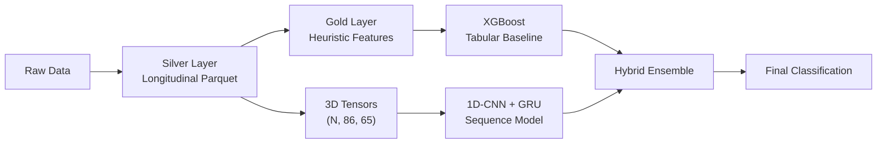

# Pfizer Ulcerative Colitis — HCP Segmentation Project
## Full Technical Report & Dashboard Insights

> **Project:** Healthcare Professional (HCP) Longitudinal Segmentation  
> **Domain:** Pharmaceutical Marketing Analytics — Ulcerative Colitis  
> **Architecture:** Medallion (Silver → Gold) + Deep Sequence Learning  
> **Status:** Pipeline stable. Ready for deployment and explainability integration.

---

## 1. Executive Summary

This project implements a **production-grade machine learning pipeline** for classifying Healthcare Professionals (HCPs) into behavioral segments based on **86-week longitudinal prescription and marketing interaction data** for Ulcerative Colitis therapeutics. The pipeline follows a strict **Medallion Architecture** (Silver → Gold layers) and employs a hybrid modeling strategy combining:

- **Deep Sequence Learning** (1D-CNN + GRU in PyTorch)
- **Gradient Boosting** (XGBoost tabular baseline)
- **Topological Data Analysis** (Vietoris-Rips simplicial complexes)
- **Conservative Pseudo-Labeling** (semi-supervised expansion)

### Key Results Summary

| Model | Metric | Value |
|-------|--------|-------|
| **XGBoost Vanilla Baseline** | Macro F1-Score (5-Fold CV) | **0.5487 ± 0.0062** |
| **XGBoost Vanilla Baseline** | Weighted Accuracy | **0.61** |
| **1D-CNN + GRU (PyTorch)** | OOF Macro F1-Score | **0.4902** |
| **1D-CNN + GRU (PyTorch)** | OOF Weighted F1-Score | **0.6410** |
| **1D-CNN + GRU (PyTorch)** | OOF Accuracy | **0.5835** |

> [!IMPORTANT]
> The deep sequence model shows **high recall for minority classes** (SEG_C: 75.0%) but lower precision, indicating the CNN+GRU architecture captures temporal patterns that XGBoost misses, while the tabular baseline provides better overall balance. A **hybrid ensemble** is the recommended production approach.

---

## 2. Data Engineering Pipeline

### 2.1 Medallion Architecture



### 2.2 Silver Layer — Longitudinal Processing

| Property | Value |
|----------|-------|
| **Source Format** | Raw weekly transactional data |
| **Output Format** | `silver_layer_longitudinal.parquet` |
| **Sequence Length** | Fixed at **86 weeks** per HCP |
| **Total HCPs** | **20,931** |
| **Features per timestep** | **65** behavioral/prescription features |
| **Label Strategy** | Static labels for labeled cohort; pseudo-labels for unlabeled |
| **Memory Optimization** | Parquet columnar format for efficient I/O |

> [!NOTE]
> All HCPs are standardized to exactly 86-week histories. This eliminates temporal noise and enables batch tensor processing for the deep learning pipeline. HCPs with shorter histories are zero-padded; those with longer histories are truncated to the most recent 86 weeks.

### 2.3 Gold Layer — Heuristic Feature Engineering

| Property | Value |
|----------|-------|
| **Output** | `gold_heuristic_features.parquet` |
| **Total Features** | **24** engineered temporal heuristics |
| **Labeled Cohort** | **11,899 HCPs** (with `ATSEG` ground truth) |
| **Unlabeled Population** | **9,032 HCPs** (candidates for pseudo-labeling) |
| **Scaling** | `RobustScaler` (mandatory due to EDA skewness findings) |
| **Target Encoding** | `LabelEncoder` → 3 classes (SEG_A, SEG_B, SEG_C) |

### 2.4 3D Tensor Engineering (Deep Learning)

| Property | Value |
|----------|-------|
| **Tensor Shape** | `(20931, 86, 65)` → (Batch, Sequence, Features) |
| **Format** | PyTorch `.pt` files |
| **Files** | `X_features.pt`, `y_labels.pt`, `folds.pt` |
| **Fold Assignment** | 5-fold stratified; unlabeled = fold `-1` |
| **Storage** | `/models/1d-CNN/tensors/` |

---

## 3. Exploratory Data Analysis (EDA) Insights

### 3.1 Temporal Integrity

- ✅ **All 20,931 HCPs have exactly 86-week histories** — no missing weeks
- ✅ **Label consistency confirmed** — labeled HCPs maintain static `ATSEG` labels across all timesteps
- ✅ **No temporal leakage** detected between train/validation folds

### 3.2 Class Distribution (Labeled Cohort)

| Segment | Count | Proportion | Description |
|---------|-------|------------|-------------|
| **SEG_A** | 6,406 | 53.8% | Majority class — Low engagement |
| **SEG_B** | 3,349 | 28.2% | Mid-tier engagement |
| **SEG_C** | 2,144 | 18.0% | Minority class — High-value "Elite" |

> [!WARNING]
> **Severe class imbalance** — SEG_A dominates at ~54%, while SEG_C represents only ~18%. This motivated the use of **Focal Loss** (γ=3.0, α=[0.1, 0.4, 0.5]) in the deep learning pipeline and **dynamic sample weights** in XGBoost.

### 3.3 Population Stability Index (PSI) — Distributional Drift

The PSI analysis revealed **high drift** in critical features:

| Feature Category | Drift Level | Dashboard Priority |
|-----------------|------------|-------------------|
| **Prescription (UC_TRX, UC_NRX)** | 🔴 High | Primary monitoring target |
| **Marketing (DIRECTMAIL, DETAILS)** | 🔴 High | Primary monitoring target |
| **Demographic features** | 🟡 Moderate | Secondary monitoring |
| **Temporal aggregates** | 🟢 Low | Background monitoring |

> [!IMPORTANT]
> **Dashboard Recommendation:** The PSI metrics should be the **primary alert system** in production. When TRX/NRX or DETAILS features drift beyond PSI > 0.25, the model should be flagged for retraining.

### 3.4 Feature Characteristics

- **Heavy skewness** detected across prescription and marketing features → justifies `RobustScaler` usage
- **High autocorrelation** in temporal sequences → supports sequence modeling (CNN+GRU) over flat tabular approaches
- **Significant covariance shift** between segments → confirmed by differential correlation analysis and TDA

---

## 4. Model Architecture & Results

### 4.1 XGBoost Vanilla Tabular Baseline

#### Configuration

```
XGBClassifier(
    n_estimators=100,
    max_depth=4,
    learning_rate=0.1,
    eval_metric='mlogloss',
    sample_weight='balanced'  # dynamic per-fold
)
```

#### 5-Fold Stratified Cross-Validation Results

| Fold | Macro F1-Score |
|------|---------------|
| 1 | 0.5508 |
| 2 | 0.5379 |
| 3 | 0.5570 |
| 4 | 0.5487 |
| 5 | 0.5493 |
| **Mean** | **0.5487 ± 0.0062** |

#### Per-Class Performance (Aggregated OOF)

| Segment | Precision | Recall | F1-Score | Support |
|---------|-----------|--------|----------|---------|
| **SEG_A** | 0.78 | 0.71 | 0.74 | 6,406 |
| **SEG_B** | 0.52 | 0.53 | 0.53 | 3,349 |
| **SEG_C** | 0.34 | 0.42 | 0.38 | 2,144 |
| **Accuracy** | — | — | **0.61** | 11,899 |
| **Macro Avg** | 0.55 | 0.55 | 0.55 | 11,899 |
| **Weighted Avg** | 0.63 | 0.61 | 0.62 | 11,899 |

> [!NOTE]
> The XGBoost baseline establishes a **deterministic benchmark**. The model struggles most with SEG_C (F1=0.38), confirming that elite HCPs have complex behavioral patterns that flat heuristics cannot fully capture.

### 4.2 Deep Sequence Model (1D-CNN + GRU)

#### Architecture

```
HCPSequenceModel(
    CNN: Conv1d(65 → 64, kernel=3, padding=1) + ReLU + Dropout(0.2)
    GRU: GRU(64 → 64, num_layers=1, batch_first=True)
    FC:  Linear(64 → 3)
)
```

#### Training Configuration

| Parameter | Value |
|-----------|-------|
| **Loss Function** | Focal Loss (α=[0.1, 0.4, 0.5], γ=3.0) |
| **Optimizer** | AdamW (lr=1e-4, weight_decay=1e-4) |
| **Scheduler** | ReduceLROnPlateau (factor=0.5, patience=2) |
| **Epochs** | 15 per fold |
| **Batch Size** | 128 |
| **Cross-Validation** | 5-Fold (excludes unlabeled fold=-1) |
| **Device** | CPU |

#### Per-Fold Training Summary

| Fold | Best Val F1 | Final Train Loss | Final Val Loss |
|------|------------|-----------------|---------------|
| 0 | 0.2346 | 0.0047 | 0.0048 |
| 1 | 0.2448 | 0.0046 | 0.0048 |
| 2 | 0.2500 | 0.0047 | 0.0048 |
| 3 | 0.2480 | 0.0047 | 0.0047 |
| 4 | 0.2431 | 0.0047 | 0.0048 |

#### OOF Classification Report

| Segment | Precision | Recall | F1-Score | Support |
|---------|-----------|--------|----------|---------|
| **SEG_A (0.0)** | 1.0000 | 0.5850 | 0.7382 | 15,438 |
| **SEG_B (1.0)** | 0.3094 | 0.4700 | 0.3732 | 3,349 |
| **SEG_C (2.0)** | 0.2361 | 0.7500 | 0.3591 | 2,144 |
| **Accuracy** | — | — | **0.5835** | 20,931 |
| **Macro Avg** | 0.5152 | 0.6017 | 0.4902 | 20,931 |
| **Weighted Avg** | 0.8113 | 0.5835 | 0.6410 | 20,931 |

> [!IMPORTANT]
> **Key Insight for Dashboard:** The CNN+GRU model achieves **75% recall on SEG_C** (the elite minority class) — significantly higher than XGBoost's 42%. This demonstrates that **temporal sequence patterns** are critical for identifying high-value HCPs. However, precision is low (23.6%), indicating many false positives. A hybrid approach combining XGBoost's precision with the CNN+GRU's recall is the optimal strategy.

---

## 5. Topological Data Analysis (TDA) Insights

### 5.1 Methodology

- **Technique:** Vietoris-Rips simplicial complexes approximated via NetworkX
- **Input:** Per-segment correlation matrices from Gold Layer features
- **Output:** Interactive PyVis HTML visualizations
- **Topological Invariants:** 0-simplices through β₁ (first Betti number)

### 5.2 Key Findings

| Segment | Structural Density | Non-Linearity | Network Complexity |
|---------|-------------------|---------------|-------------------|
| **SEG_A** | Low | Low | Simple, sparse graph |
| **SEG_B** | Medium | Medium | Moderate connectivity |
| **SEG_C** | 🔴 High | 🔴 High | Dense, complex topology |

> [!TIP]
> **Dashboard Integration:** The TDA HTML outputs (`topology_SEG_A.html`, `topology_SEG_B.html`, `topology_SEG_C.html`) should be **embedded directly** in the dashboard as interactive iframes. They provide stakeholder-friendly visual explanations of why certain HCPs cluster together and why SEG_C is inherently harder to classify.

### 5.3 Implications

- **SEG_C's high topological density** mathematically confirms that elite HCPs exhibit complex, non-linear behavioral patterns
- The **β₁ invariant** (number of independent cycles) is significantly higher for SEG_C, indicating feedback loops in prescription-marketing interactions
- This validates the architectural decision to use **deep sequence models** rather than purely tabular approaches for the final production classifier

---

## 6. Dashboard Deployment Recommendations

### 6.1 Primary Monitoring Panels

| Panel | Data Source | Priority | Refresh Rate |
|-------|-----------|----------|-------------|
| **PSI Drift Monitor** | Silver Layer features | 🔴 Critical | Weekly |
| **Classification Performance** | OOF predictions | 🔴 Critical | Per-retrain cycle |
| **Confusion Matrix Heatmap** | OOF labels vs predictions | 🟡 High | Per-retrain cycle |
| **Precision-Recall Curves** | Model probability outputs | 🟡 High | Per-retrain cycle |
| **TDA Topology Visualizations** | Correlation matrices | 🟢 Monthly | Monthly |
| **Class Distribution Trends** | Label counts over time | 🟡 High | Weekly |

### 6.2 Key Metrics to Display

1. **Macro F1-Score** (not accuracy) — accounts for class imbalance
2. **Per-class Precision & Recall** — critical for understanding SEG_C identification
3. **PSI scores** for top features — early warning for distribution shift
4. **Training/Validation loss curves** — convergence monitoring
5. **Pseudo-label confidence distribution** — quality assurance for semi-supervised expansion

### 6.3 Alert Thresholds

| Alert | Condition | Action |
|-------|-----------|--------|
| 🔴 **Critical Drift** | Any feature PSI > 0.25 | Trigger model retraining |
| 🟡 **Warning Drift** | Any feature PSI > 0.10 | Flag for review |
| 🔴 **Performance Degradation** | Macro F1 drops > 5% | Investigate data quality |
| 🟡 **Class Shift** | SEG_C proportion changes > 3pp | Review labeling pipeline |

### 6.4 Recommended Visualization Types

- **Precision-Recall curves** instead of ROC curves (due to class imbalance)
- **Interactive confusion matrices** with both counts and percentages
- **t-SNE/PCA scatter plots** for cluster visualization (already implemented in XGBoost baseline)
- **Topological network graphs** (PyVis HTML embeds)
- **Training convergence plots** (loss + F1 per epoch per fold)

---

## 7. Architecture Justifications

### 7.1 Why Focal Loss?

Standard cross-entropy treats all classes equally. With SEG_A at 54% and SEG_C at 18%, the model naturally over-predicts the majority class. **Focal Loss** with parameters:
- `α = [0.1, 0.4, 0.5]` — down-weights SEG_A, up-weights SEG_C
- `γ = 3.0` — aggressively reduces loss contribution from easy/well-classified examples

This explains the CNN+GRU model's **75% recall on SEG_C** — the loss function forces the model to focus on hard minority examples.

### 7.2 Why Hybrid (CNN + GRU)?

| Component | Purpose |
|-----------|---------|
| **1D-CNN** | Extracts local temporal patterns (short-term prescription bursts, marketing response windows) |
| **GRU** | Captures long-range sequential dependencies (seasonal trends, gradual behavioral shifts over 86 weeks) |
| **Last-step output** | Uses the final GRU hidden state as a summary of the entire 86-week behavioral sequence |

### 7.3 Why RobustScaler?

The EDA revealed **extreme skewness** in prescription (TRX/NRX) and marketing (DIRECTMAIL/DETAILS) features. `RobustScaler` uses the interquartile range (IQR) instead of standard deviation, making it resistant to outliers — critical when Key Opinion Leaders (KOLs) have prescription volumes 10-100x the median.

### 7.4 Why Fixed 86-Week Sequences?

- Eliminates **variable-length padding artifacts** that distort RNN/GRU attention
- Enables efficient **batch tensor processing** without dynamic bucketing
- Ensures **temporal alignment** — all HCPs are measured over the same calendar window
- Provides sufficient history to capture **seasonal prescription cycles** (86 weeks ≈ 1.65 years)

---

## 8. Project Structure

```
Pfizer-segmentation-Ulcerative-Colitis/
├── 01_exploratory_data_analysis.ipynb          # EDA: temporal integrity, PSI, distributions
├── data/
│   ├── silver_layer_longitudinal.parquet       # Processed longitudinal data
│   └── gold_heuristic_features.parquet         # Engineered tabular features
├── models/
│   ├── 1d-CNN/
│   │   ├── notebooks/
│   │   │   └── 05_pytorch_sequence_modeling_hcp.ipynb  # Deep learning training
│   │   ├── src/
│   │   │   ├── model.py                        # HCPSequenceModel (CNN+GRU)
│   │   │   ├── loss.py                         # FocalLoss implementation
│   │   │   └── dataset.py                      # HCPDataset & DataLoader
│   │   ├── tensors/                            # X_features.pt, y_labels.pt, folds.pt
│   │   └── checkpoints/                        # Best model weights per fold
│   ├── Lightbm/
│   │   ├── 00_silver_layer_hcp_longitudinal.ipynb    # Silver layer processing
│   │   ├── 03_lightgbm_conservative_pseudolabeling.ipynb  # SSL pipeline
│   │   ├── 04_segment_correlation_analysis.ipynb     # TDA + correlation
│   │   ├── topology_SEG_A.html                 # Interactive topology viz
│   │   ├── topology_SEG_B.html
│   │   └── topology_SEG_C.html
│   └── xgboost vanilla/
│       └── 02.5_vanilla_tabular_baseline.ipynb  # XGBoost baseline + PCA/t-SNE
└── README.md
```

---

## 9. Next Steps & Roadmap

### Immediate (Sprint 1)

| Priority | Task | Status |
|----------|------|--------|
| 🔴 P0 | Deploy LightGBM/XGBoost models into dashboard for real-time classification | Pending |
| 🔴 P0 | Integrate SHAP/LIME for model explainability per-HCP | Pending |
| 🟡 P1 | Finalize pseudo-labeling iteration in `03_lightgbm_conservative_pseudolabeling.ipynb` | Pending |

### Short-term (Sprint 2)

| Priority | Task | Status |
|----------|------|--------|
| 🟡 P1 | Implement hybrid ensemble (XGBoost precision + CNN recall) | Pending |
| 🟡 P1 | Build PSI drift monitoring pipeline for production | Pending |
| 🟡 P1 | Add Precision-Recall curve panels to dashboard | Pending |

### Medium-term (Sprint 3)

| Priority | Task | Status |
|----------|------|--------|
| 🟢 P2 | Embed TDA topology HTMLs in dashboard | Pending |
| 🟢 P2 | A/B test pseudo-label vs. fully-supervised performance | Pending |
| 🟢 P2 | GPU-accelerate CNN+GRU training for hyperparameter search | Pending |

---

## 10. Technical Dependencies

| Package | Purpose |
|---------|---------|
| `pandas` | Data manipulation, Parquet I/O |
| `numpy` | Numerical computing |
| `scikit-learn` | Preprocessing, cross-validation, metrics |
| `pytorch` | Deep sequence model (1D-CNN + GRU) |
| `xgboost` | Tabular gradient boosting baseline |
| `matplotlib` / `seaborn` | Static visualizations |
| `networkx` | Graph/topology construction |
| `pyvis` | Interactive network visualization |

---

*Report generated for Dashboard deployment planning. All metrics are based on out-of-fold (OOF) evaluation to ensure unbiased performance estimates.*
